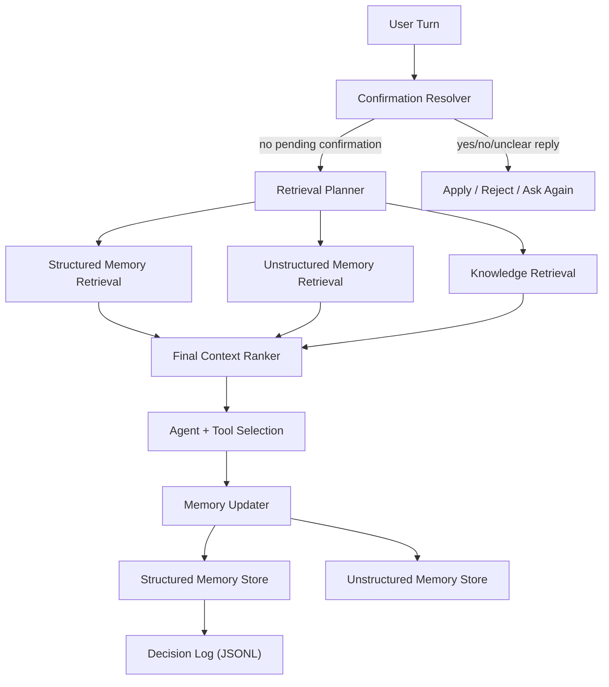

# Stateful Agent

A recruiter-friendly demo of a memory-aware AI assistant built with LangGraph, OpenRouter, local JSON memory, and Chroma-backed retrieval.

The project focuses on a practical problem that makes agents feel more useful over time: remembering user facts, retrieving the right context later, and handling immutable-memory corrections safely instead of silently overwriting them.

## What This Project Demonstrates

- How to build a stateful LLM application instead of a one-shot chatbot.
- How to combine structured memory, unstructured memory, retrieval, and tool use in one agent flow.
- How to design safer memory systems with immutable fields, confirmation prompts, and audit logging.
- How to harden LLM-shaped boundaries such as retrieval planning and final context ranking.
- How to test agent infrastructure offline without depending on live model calls.

## Why This Project Is Interesting

- Stateful conversations: the agent can store stable user facts and reuse them later.
- Safe memory updates: immutable fields such as `birthdate` are write-once protected.
- Correction flow: conflicting immutable updates trigger a confirmation step instead of a silent overwrite.
- Retrieval safety: planner and ranker outputs are normalized so malformed LLM output does not dump all memory into context.
- Local auditability: structured memory decisions are logged to JSONL for debugging.
- Strong offline test coverage: the core memory, retrieval, confirmation, and ranking paths are tested without live model calls.

## Demo Highlights

This repo is best shown with a short CLI demo. The prepared script is in [demo_script.md](/Users/nebielmohammed/Projects/statefull_agent/demo_script.md) and covers:

- saving a birthdate as structured memory
- remembering that birthdate later and deriving age from it
- storing food and health preferences
- using saved preferences in a recommendation
- triggering an immutable-memory conflict on a write-once field
- resolving that conflict explicitly with `yes` or `no`

## Architecture Overview



## Project Structure

```text
app/
  core/           settings and logging
  db/             lazy vectorstore setup
  llm/            model client, prompts, extraction helpers
  models/         memory schema and domain constants
  repositories/   JSON persistence and decision logging
  schemas/        shared state types
  services/       graph, chat loop, memory, retrieval, tools
  utils/          reusable helpers
tests/            offline unit and integration-style tests
main.py           CLI entry point
demo_script.md    guided recruiter demo
```

## Memory System

The agent uses two kinds of memory:

### Structured memory

Stored in local JSON and used for stable facts such as:

- `birthdate`
- `favorite_food`
- `diet`
- `goal`
- `weight`

Structured memory powers deterministic retrieval and features like age derivation.

### Unstructured memory

Stored in Chroma and used for softer context such as:

- dislikes
- habits
- preferences
- background context

### Immutable memory handling

Some fields, such as `birthdate`, are treated as write-once immutable:

- if missing, they can be stored
- if the same value appears again, nothing changes
- if a different value appears later, the agent asks for confirmation
- confirmed changes are applied only through the dedicated confirmation resolver

### Memory decision logging

Every structured memory write attempt produces a JSONL log entry in `data/memory_decision_log.jsonl` with:

- timestamp
- user id
- field/category
- existing and proposed values
- decision
- reason

## Testing Strategy

This repo is designed to be demo-friendly and testable without external services.

The test suite covers:

- structured memory persistence
- immutable overwrite protection
- confirmation and correction flow
- decision logging
- retrieval relevance
- retrieval planner robustness
- final context/ranking safety
- lazy initialization and import safety

The tests are intentionally offline:

- no live OpenRouter calls
- no live Hugging Face calls
- no live network access
- vectorstore-dependent behavior is mocked where determinism matters

## Setup

### Requirements

- Python 3.13
- a virtual environment at `.venv`
- an OpenRouter or OpenAI-compatible API key in `.env`

### Environment variables

Copy `.env.example` to `.env` and fill in your own values. The project expects:

```env
OPENROUTER_API_KEY=your_key_here
OPENAI_API_KEY=your_key_here
HF_TOKEN=your_huggingface_token
```

`HF_TOKEN` is not required, but it helps with Hugging Face rate limits and model downloads.

### Install dependencies

```bash
./.venv/bin/pip install -r requirements.txt
```

## Run Locally

Start the CLI:

```bash
./.venv/bin/python main.py
```

Exit with:

```text
quit
```

or

```text
exit
```

## Run the Demo

1. Start the app:

```bash
./.venv/bin/python main.py
```

2. Follow the conversation in [demo_script.md](/Users/nebielmohammed/Projects/statefull_agent/demo_script.md).

3. Watch for these moments:

- the agent remembers your birthdate later
- the age answer is derived from stored memory instead of being guessed
- food recommendations use saved preferences
- a conflicting birthdate triggers a confirmation question
- `yes` and `no` replies resolve that pending update safely

## Example Conversation

```text
You: I was born on 1995-04-12.
You: I dislike pork and I am trying to lose weight.
You: What should I cook today?
AI: ... recommendation shaped by dislike + goal ...

You: How old am I?
AI: ... derived from the stored birthdate ...

You: Actually my birthdate is 1996-04-12.
AI: I currently have 1995-04-12 saved as your birthdate. Do you want me to replace it with 1996-04-12?
You: no
AI: Okay, I kept your birthdate as 1995-04-12.
```

## CI

The repo includes a GitHub Actions workflow that:

- installs dependencies
- runs `pytest`
- runs `py_compile`

This makes the repo feel more production-ready for reviewers and recruiters.

## Notes

- Importing the project is lazy-safe; model clients and vectorstores are created only when needed.
- Running the CLI still requires real credentials and may download the embedding model on first use.
- `data/` contains runtime state and should generally not be committed.
- `.env.example` is safe to commit; `.env` should remain local.
